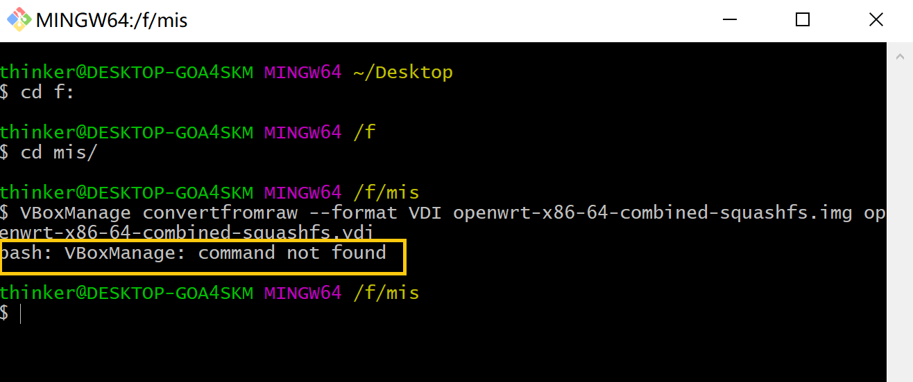
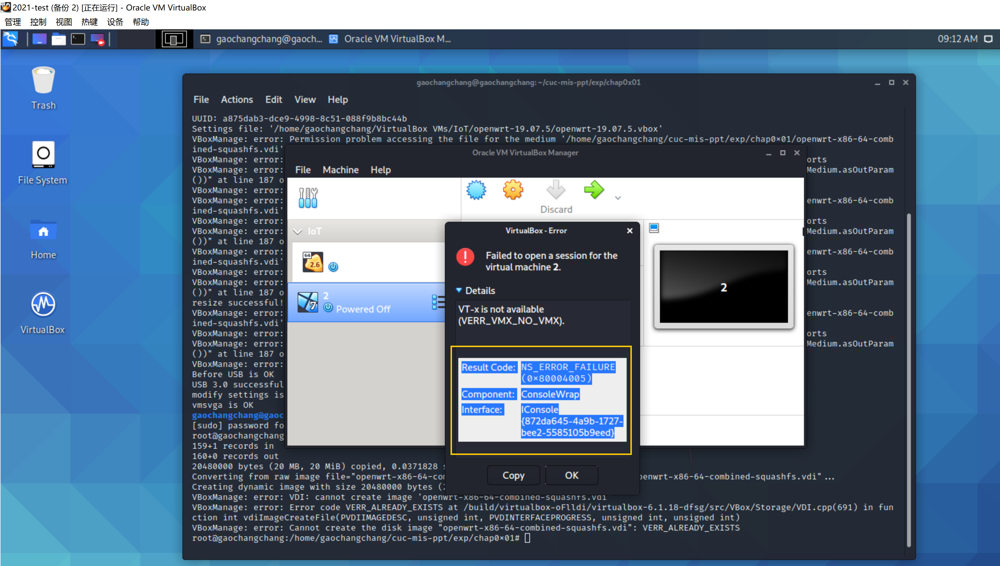
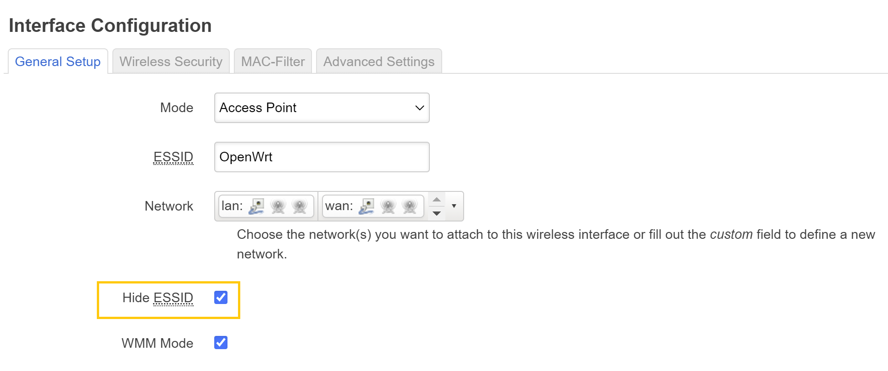
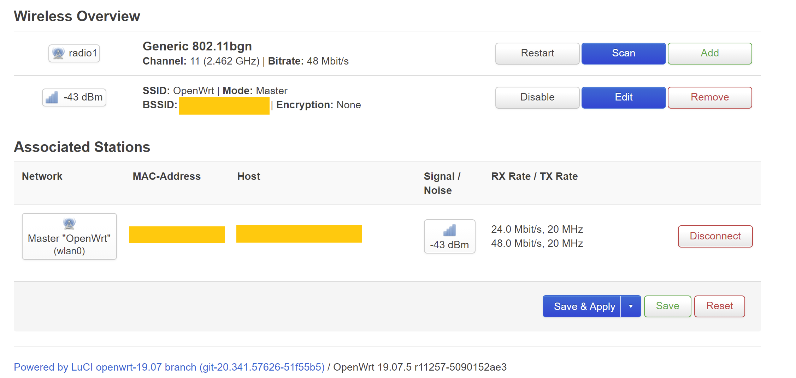
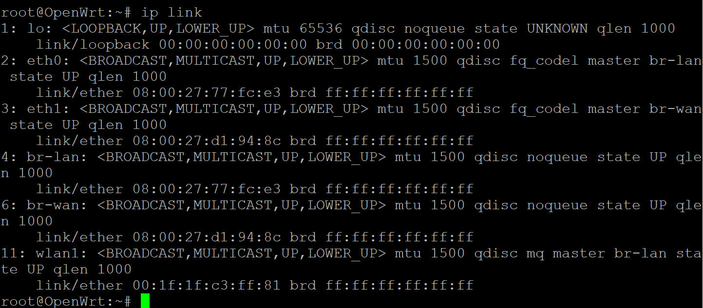

# 实验一：OpenWrt 虚拟机搭建

实验概要

-  [实验目的](#实验目的)
- [实验环境](#实验环境)
  - [实验要求](#实验要求)
  - [实验过程](#实验过程)
      - [复习VirtualBox的配置与使用](#复习VirtualBox的配置与使用)
      - [OpenWrt-on-VirtualBox](#OpenWrt-on-VirtualBox)
          - [手动安装步骤](#手动安装步骤)
          - [脚本自动安装步骤](#脚本自动安装步骤)
              - [在主机Win10上运行脚本](#在主机Win10上运行脚本)
              - [在virtualbox中运行脚本](#在virtualbox中运行脚本)
      - [开启AP功能](#开启AP功能)
      - [无线路由器/无线接入点（AP）配置](#无线路由器/无线接入点（AP）配置)
      - [使用手机连接不同配置状态下的AP对比实验](#使用手机连接不同配置状态下的AP对比实验)
      - [使用路由器/AP的配置导出备份功能，尝试解码导出的配置文件](#使用路由器/AP的配置导出备份功能，尝试解码导出的配置文件)
  - [问题与解决方法](#问题与解决方法)
  - [参考资料](#参考资料)


## **实验目的**

- 熟悉基于 OpenWrt 的无线接入点（AP）配置
- 为第二章、第三章和第四章实验准备好「无线软 AP」环境

## **实验环境**
- 可以开启监听模式、AP 模式和数据帧注入功能的 USB 无线网卡——RT2870/RT3070
- Virtualbox 6.1.12
- OpenWrt 19.07.5
- Kali 2020.3
- Windows 10 专业版

## **实验要求**

- [x] 对照 [第一章 实验](https://c4pr1c3.github.io/cuc-mis/chap0x01/exp.html) `无线路由器/无线接入点（AP）配置` 列的功能清单，找到在 OpenWrt 中的配置界面并截图证明；

- [x] 记录环境搭建步骤；

- [x] 如果 USB 无线网卡能在 `OpenWrt` 中正常工作，则截图证明；

  如果 USB 无线网卡不能在 `OpenWrt` 中正常工作，截图并分析可能的故障原因并给出可能的解决方法。


## **实验过程**


### 复习VirtualBox的配置与使用

- 虚拟机镜像列表

  查看`管理->虚拟介质管理`

  

- 设置虚拟机和宿主机的文件共享，实现宿主机和虚拟机的双向文件共享

  查看`设置->共享文件夹`

  

- 虚拟机镜像备份和还原的方法

  

- 熟悉虚拟机基本网络配置，了解不同联网模式的典型应用场景

  查看`设置->网络`

  

### OpenWrt-on-VirtualBox

#### 手动安装步骤

```bash
# 下载镜像文件
wget https://downloads.openwrt.org/releases/19.07.5/targets/x86/64/openwrt-x86-64-combined-squashfs.img.gz
```


```bash
# 解压缩
gunzip openwrt-x86-64-combined-squashfs.img.gz

# img 格式转换为 Virtualbox 虚拟硬盘格式 vdi
VBoxManage convertfromraw --format VDI openwrt-x86-64-combined-squashfs.img openwrt-x86-64-combined-squashfs.vdi
```


执行格式转换命令时，报错没有`VBoxManage`的命令





将VBoxManage的路径添加到环境变量中


再次执行格式转换命令，出现新的报错


将镜像进行填充，并对填充后的镜像进行格式转换

```bash
# 对镜像填充
dd if=openwrt-x86-64-combined-squashfs.img of=openwrt-x86-64-combined-squashfs-padded.img bs=128000 conv=sync

#格式转换
VBoxManage convertfromraw --format VDI openwrt-x86-64-combined-squashfs-padded.img openwrt-x86-64-combined-squashfs.vdi
```


对磁盘进行扩容

```bash
 VBoxManage modifymedium disk --resize 10240 openwrt-x86-64-combined-squashfs.vdi
```


新建虚拟机选择「类型」 Linux / 「版本」Linux 2.6 / 3.x / 4.x (64-bit)，填写有意义的虚拟机「名称」


将目标 vdi 修改为「多重加载」


设置USB接口


ps：要想开启USB 3.0控制器需提前安装**virtualbox extension pack**——[下载链接](https://www.virtualbox.org/wiki/Downloads)


网卡配置


成功启动openwrt虚拟机


修改远程管理专用网卡的 IP 地址，只需要修改 `option ipaddr` 的值即可


```bash
# 重启网络
ifdown lan && ifup lan

# 以root身份ssh远程连接，无需密码

# 查看ip地址
ip a
```


安装`luci`


```bash
# 更新 opkg 本地缓存
opkg update

# 检索指定软件包
opkg find luci
# luci - git-19.223.33685-f929298-1

# 查看 luci 依赖的软件包有哪些 
opkg depends luci
# luci depends on:
#     libc
#     uhttpd
#     uhttpd-mod-ubus
#     luci-mod-admin-full
#     luci-theme-bootstrap
#     luci-app-firewall
#     luci-proto-ppp
#     libiwinfo-lua
#     luci-proto-ipv6

# 查看系统中已安装软件包
opkg list-installed

# 安装 luci
opkg install luci

# 查看 luci-mod-admin-full 在系统上释放的文件有哪些
opkg files luci-mod-admin-full
# Package luci-mod-admin-full (git-16.018.33482-3201903-1) is installed on root and has the following files:
# /usr/lib/lua/luci/view/admin_network/wifi_status.htm
# /usr/lib/lua/luci/view/admin_system/packages.htm
# /usr/lib/lua/luci/model/cbi/admin_status/processes.lua
# /www/luci-static/resources/wireless.svg
# /usr/lib/lua/luci/model/cbi/admin_system/system.
# ...
# /usr/lib/lua/luci/view/admin_network/iface_status.htm
# /usr/lib/lua/luci/view/admin_uci/revert.htm
# /usr/lib/lua/luci/model/cbi/admin_network/proto_ahcp.lua
# /usr/lib/lua/luci/view/admin_uci/changelog.htm
```


安装好 `luci` 后通过浏览器访问管理 `OpenWrt` 的效果截图，初次登录没有密码，直接回车即可


#### 脚本自动安装步骤

##### 在主机Win10上运行脚本

通过修改老师的脚本，使能够在本机上自动安装OpenWrt


[查看脚本](./code/setup-vm.sh)

PS:

- Host-Only网卡中hostonlyadapter1处的修改，改成和下图名字一致即可
- 需要提前安装wget的下载包，并把wget放到D:\Program Files\Git\mingw64\bin\目录下（在我的电脑）


打开openwrt-19.07.5-demo可以正常启动


##### 在virtualbox中运行脚本


执行脚本后，开机报错


由于感觉不是脚本本身的问题，于是新建了一个虚拟机，按正常操作创建，打开后和上图报相同的错误，故在虚拟机中装虚拟机（套娃）失败



### 开启AP功能


```bash
# 每次重启 OpenWRT 之后，安装软件包或使用搜索命令之前均需要执行一次 opkg update
opkg update && opkg install usbutils

# 查看 USB 外设的标识信息
lsusb

# 查看 USB 外设的驱动加载情况
lsusb -t
```


```bash
# 安装驱动

opkg find kmod-* | grep 3070
opkg install kmod-gigaset

opkg find kmod-* | grep 2870
opkg install kmod-rt2800-usb
```

可以看见驱动已安装


可以识别网卡


默认情况下，OpenWrt 只支持 `WEP` 系列过时的无线安全机制。为了让 OpenWrt 支持 `WPA` 系列更安全的无线安全机制，还需要额外安装 2 个软件包：`wpa-supplicant` 和 `hostapd` 。其中 `wpa-supplicant` 提供 WPA 客户端认证，`hostapd` 提供 AP 或 ad-hoc 模式的 WPA 认证。执行后出现`Wireless`选项

```bash
opkg install hostapd wpa-supplicant
```


网络配置


没连接设备时


连接了两个设备后


### 无线路由器/无线接入点（AP）配置

- 重置和恢复AP到出厂默认设置状态

  

- 设置AP的管理员用户名和密码

  

- 设置SSID广播和非广播模式

  

- 配置不同的加密方式

  

- 设置AP管理密码

  

- 配置无线路由器使用自定义的DNS解析服务器

  

- 配置DHCP和禁用DHCP

  

  

  

- 开启路由器/AP的日志记录功能（对指定事件记录）

  

- 配置AP隔离(WLAN划分)功能

  

- 设置MAC地址过滤规则（ACL地址过滤器）

  

- 查看WPS功能的支持情况

  

  

  

- 查看AP/无线路由器支持哪些工作模式

  

### 使用手机连接不同配置状态下的AP对比实验

由于openwrt可以正常连接但是无法上网的问题，该部分可做操作实在有限QAQ，问题尚未解决

- 配置不同的加密方式

  **无加密**

  

  **WPA-PSK/WPA2-PSK Mixed Mode(medium secuity)方式加密**

  将无线网络改成加密模式后，**无法接入网络**，显示**已停用/网络拒绝接入**

  


### 使用路由器/AP的配置导出备份功能，尝试解码导出的配置文件


此处的配置文件以明文方式显示

## **问题与解决方法**

1. **无线网络状态为Wireless is not associated（已解决）**

   解决方法：

   - 网卡重新插拔
   - 使用`reboot`命令重启虚拟机
   - 实在不行重启主机（重启大法好！）

2. **网卡连接时间久一点就会出现电脑无法识别的现象（已解决）**

   解决方法：

   - 刚开始还只是插拔网卡就可以重新识别网卡，后期需要`reboot`+插拔网卡配套进行，才能重新识别....(顺便说一句，我觉得网卡烫到要爆炸...)

3. **wget获取https地址显示不安全，不能确保目标网址的证书安全性（已解决）**

   

   解决方法：

   - 在wget后面加上`--no-check-certificate`，但是存在很大的安全隐患！

4. **在虚拟机中装虚拟机会报错（未解决）**

   我就是试一试这种套娃行为，请问老师/师姐，是不可以虚拟机中装虚拟机吗？

   

   该虚拟机配置如下

   

5. **可以正常接入openwrt但是无法上网（未解决）**

- 可以正常ping通网络

  

- 查看`/etc/config/wireless`文件

  

- 无线网络状态查看

  

- `ip link`,网卡为UP状态

  

- 结果如[使用手机连接不同配置状态下的AP对比实验](#使用手机连接不同配置状态下的AP对比实验)所示

- 请问老师/师姐，无法上网的原因是因为网卡的问题还是某些文件配置的问题？😅

## **参考资料**

[how-to-run-vboxmanage-exe](https://serverfault.com/questions/365423/how-to-run-vboxmanage-exe)

[Convert openwrt.img to VBox drive](https://openwrt.org/docs/guide-user/virtualization/virtualbox-vm)

[wps-on-off-in-luci](https://forum.openwrt.org/t/wps-on-off-in-luci/1046)

[wget获取https地址报错 --no-check-certificate](https://blog.csdn.net/u010073893/article/details/50895851?utm_medium=distribute.pc_relevant.none-task-blog-2%7Edefault%7EBlogCommendFromMachineLearnPai2%7Edefault-1.control&dist_request_id=&depth_1-utm_source=distribute.pc_relevant.none-task-blog-2%7Edefault%7EBlogCommendFromMachineLearnPai2%7Edefault-1.control)


