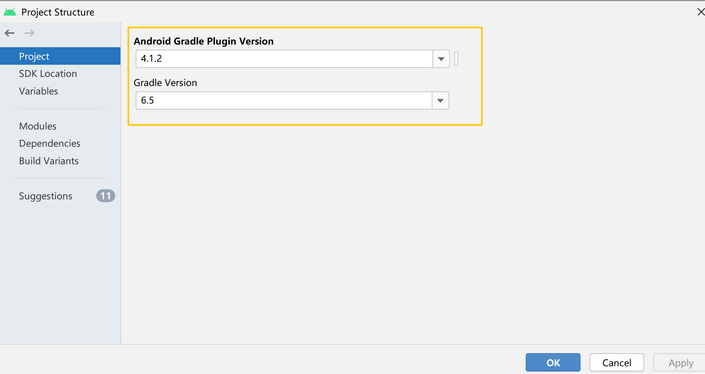

## 实验五：Android模拟器环境搭建

### **实验目的**

通过Android Studio熟悉Android模拟器环境搭建的基本过程

### **实验环境**
- Android Studio 4.1.2
-  Windows 10 专业版 1909

### **实验要求**

- [x]  安装和配置 Java SDK
- [x]  安装Android Studio
- [x]  下载安装 Android SDK
- [x] 配置 Android 模拟器运行环境
- [x] 配置 Gradle 编译环境

### **实验过程**

- **安装和配置 Java SDK**

  Android Studio安装后已经内置了 Java 运行时环境，Android Studio在编译当前项目时使用的 JDK 目录

  

- **安装Android Studio**

  不断点击`next`，很顺滑的安装过程

  

- **下载安装 Android SDK**

  在Appearance & Behavior➡System Settings➡Android SDK➡SDK Platforms中可以查看SDK不同版本

- **配置 Android 模拟器运行环境**

  安装 Intel x86 Emulator Accelerator (HAXM installer)

  

  选择匹配Android 11.0版本的系统映像

  

  在AVD管理器中查看刚刚创建的Pixel 4 API 30

  

  点击Run，运行结果如下

  

  测试了几个小功能，我直呼太强了吧！

  

- **配置 Gradle 编译环境**

   Android Studio 的内置 Gradle版本6.5以及插件版本4.1.2

  

  【补充-自己安装Gradle的过程】

  - 在[官网](https://services.gradle.org/distributions/)上下载所需的Gradle版本并解压
  - 将所有文件复制粘贴到`C:\Users\{USERNAME}\.gradle\wrapper\dists\`目录下

### **问题与解决方法**

- 在**安装和配置 Java SDK**过程中，点击File->Project Structure无反应，报错`project structure is unavailable while sync is in progress`
  - 解决方法：File -> Invalidate caches / Restart

### **参考资料**

[第五章实验指南](https://c4pr1c3.github.io/cuc-mis/chap0x05/exp.html)

[在 Android 模拟器上运行应用](https://developer.android.com/studio/run/emulator)

[project structure is unavailable while sync is in progress](https://stackoverflow.com/questions/47513196/gradle-project-sync-failed-on-android-studio-3-0-1)

[manually-install-gradle-and-use-it-in-android-studio](https://stackoverflow.com/questions/26254526/manually-install-gradle-and-use-it-in-android-studio)

