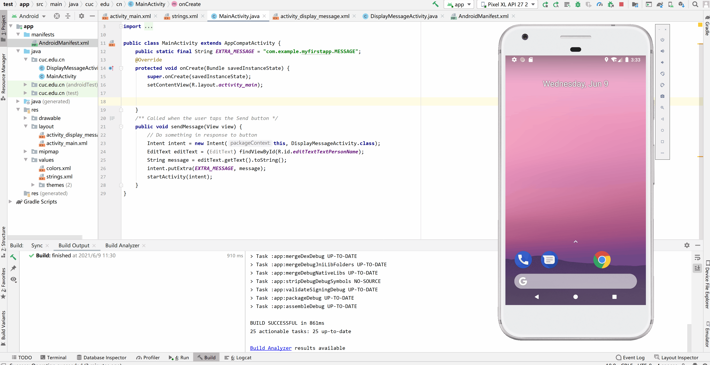

# 实验六 安卓系访问控制策略与机制


## **实验目的**

- 熟悉Android 应用的简单开发
- Hello World v2程序为后续软件逆向实验准备环境

## **实验环境**
- Android Studio 4.1.2

- AVD
  - Pixel XL API 27
  - Pixel XL API 27 2

## **实验过程**


### ADB实验

```bash
# 查看开启的模拟器
adb devices

# 连接模拟器终端
adb -s emulator-5554 shell

# 输出环境变量
echo $PATH

# 查看系统版本
uname -a

# 查看所有用户信息
cat /data/system/users/userlist.xml 

# 查看本机 MAC 地址
cat /sys/class/net/wlan0/address
```


```bash
# 将文件复制到设备/从设备复制文件
adb pull remote local
adb push local remote
```


```bash
# 安装应用
adb install path_to_apk
```


### Activity Manager (am)

```bash
# Camera（照相机）的启动方法为:
adb shell am start -a android.media.action.STILL_IMAGE_CAMERA

# Video（摄像机）的启动方法为:
adb shell am start -a android.media.action.VIDEO_CAMERA

# 启动浏览器 :
adb shell am start -a android.intent.action.VIEW -d  https://www.baidu.com/

# 拨打电话 :
adb shell am start -a android.intent.action.CALL -d tel:10086

# 发短信：
adb shell am start -a android.intent.action.SENDTO -d sms:10086 --es sms_body HaveFun! --ez exit_on_sent true

```


### 软件包管理器 (pm)


```bash
# 列出所有程序
adb shell pm list packages
```


###  其他adb实验


```bash
# 常用的按键对应的KEY_CODE
# 回车按下
adb shell input keyevent 66
# 焦点去到发送键
adb shell input keyevent 22
# 物理返回键
adb shell input keyevent 4
# 物理HOME键
adb shell input keyevent 3
```


### Hello World v1

参考[使用Android Studio一步一步创建并运行的Hello World程序指南](https://developer.android.google.cn/training/basics/firstapp/creating-project.html)，修改处：

- Application Name设置为：MISDemo
- Company Domain设置为：cuc.edu.cn


代码修改处

```java
// MainActivity.java
// EditText editText = (EditText) findViewById(R.id.editText);
EditText editText = (EditText) findViewById(R.id.editTextTextPersonName);
//此处的修改要与activity_main.xml中的id名相对应
```



### 回答问题

**按照向导创建的工程在模拟器里运行成功的前提下，生成的APK文件在哪儿保存的？**


**使用adb shell是否可以绕过MainActivity页面直接“唤起”第二个DisplayMessageActivity页面？是否可以在直接唤起的这个DisplayMessageActivity页面上显示自定义的一段文字，比如：你好移动互联网安全**

可以

```bash
adb shell am start -n cuc.edu.cn/cuc.edu.cn.DisplayMessageActivity --es "com.example.myfirstapp.MESSAGE" "Hi Mobile Internet Security"
```


**如何实现在真机上运行你开发的这个Hello World程序？**

根据官网步骤操作


**如何修改代码实现通过 `adb shell am start -a android.intent.action.VIEW -d http://sec.cuc.edu.cn/` 可以让我们的cuc.edu.cn.misdemo程序出现在“用于打开浏览器的应用程序选择列表”？**

```java
// APP/manifests/AndroidManifest.xml  <activity android:name=".MainActivity">
<action android:name="android.intent.action.VIEW" />
<category android:name="android.intent.category.DEFAULT" />
<category android:name="android.intent.category.BROWSABLE" />
<data android:scheme="http" />
<data android:scheme="https" />
```


**如何修改应用程序默认图标？**

右键app->New->Image Asset


点击Run运行即可


**如何修改代码使得应用程序图标在手机主屏幕上实现隐藏？**

```java
//app/res/MainActivity.java onCreate
 PackageManager p = getPackageManager();
        p.setComponentEnabledSetting(getComponentName(), PackageManager.COMPONENT_ENABLED_STATE_DISABLED, PackageManager.DONT_KILL_APP);
```

可以看到图标动态消失的过程


### Hello World v2

- 在v1基础之上，我们增加以下新功能来为后续的程序逆向和组件安全实验做一些“标靶”
  - 使用SharedPreferences持久化存储小数据并按需读取
  - 实现一个简单的注册码校验功能

```java
//activity_display_message.xml 添加
android:id="@+id/activity_display_message">
```


每次输入数据时会存储上次输入的数据，实现了持久化存储小数据功能


`sec.cuc.edu.cn`的md5值前四位是`6aea`，故在输入字符`6aea`时显示注册成功，其他显示注册失败，实现简单的注册码校验功能


### 回答问题

- **DisplayMessageActivity.java中的2行打印日志语句是否有风险？如果有风险，请给出漏洞利用示范。如果没有风险，请给出理由。**

  

  

  有风险

  日志打印输入的明文，容易被获取正确的信息

  代码注入，`LogCat` 查看程序执行到特定点时的（变量和关键数据结构）状态数据，在解密程序数据时经常使用 【[参考第七章教材](https://c4pr1c3.github.io/cuc-mis/chap0x07/main.html#%E4%BB%A3%E7%A0%81%E6%B3%A8%E2%BC%8A%E6%B3%95%EF%BC%88%E5%8A%A8%E6%80%81%E8%B0%83%E8%AF%95%E5%92%8C%E5%88%86%E6%9E%90%EF%BC%89)】


- **SharedPreferences类在进行读写操作时设置的`Context.MODE_PRIVATE`参数有何作用和意义？还有其他可选参数取值吗？**

  SharedPreferences以xml的形式保存在` data/data/包名/shared_prefs`这个目录下

  - **MODE_PRIVATE:** 该模式下，创建的文件只能被本应用访问，进行读、写操作

  - **MODE_APPEND:** 模式会检查文件是否存在，存在就往文件追加内容，否则就创建新文件

  - **MODE_WORLD_READABLE:** 表示当前文件可以被其他应用读取

  - **MODE_WORLD_WRITEABLE:** 表示当前文件可以被其他应用写入

## **问题与解决方法**

1. **在进行Hello World v1实验时，添加文本框时选择了TextView**

   解决方法：

   - 改成`Plain Text`后过程非常顺滑（老师口中的**跳字阅读**QAQ）
   

## **参考资料**

[2018-NS-Public-jckling](https://github.com/CUCCS/2018-NS-Public-jckling/blob/master/mis-0x06/AS%E5%AE%9E%E9%AA%8C%E6%8A%A5%E5%91%8A.md)

[实验六 安卓系统访问控制策略与机制](https://c4pr1c3.github.io/cuc-mis/chap0x06/exp.html)

[android developer](https://developer.android.com/reference/android/content)

[Can Android studio emulator camera take pictures?](https://www.quora.com/Can-Android-studio-emulator-camera-take-pictures)

[How can I run Android camera application from adb shell?](https://stackoverflow.com/questions/7402158/how-can-i-run-android-camera-application-from-adb-shell)

[md5decrypt](https://md5decrypt.net/)

[SharedPreferences的四种模式](https://blog.csdn.net/mingli198611/article/details/7088474)


