# 实验七 软件逆向系列实验

## **实验要求**

- [x] 使用apktool反汇编上一章实验中我们开发的Hello World v2版程序，对比Java源代码和smali汇编代码之间的一一对应关系。
- [x] 对Hello World v2版程序生成的APK文件进行程序图标替换，并进行重打包，要求可以安装到一台未安装过Hello World v2版程序的Android模拟器中。
- [x] 尝试安装重打包版Hello World v2到一台已经安装过原版Hello World v2程序的模拟器中，观察出错信息并解释原因。
- [x] 去掉Hello World v2版程序中DisplayMessageActivity.java代码中的那2行日志打印语句后编译出一个新的apk文件，假设文件名是：misdemo-v3.apk，尝试使用课件中介绍的几种软件逆向分析方法来破解我们的认证算法。

## **实验环境**
- Android Studio 4.1.2

- AVD
  - Pixel XL API 27 2
- Apktool_2.5.0.jar

## **实验过程**

### smali代码分析

- 检出[Deliberately Vulnerable Android Hello World](https://github.com/c4pr1c3/DVAHW)最新版代码，在Android Studio中导入该项目；

- 生成的发布版apk文件位于项目根目录下相对路径：`app/app-release.apk`；

  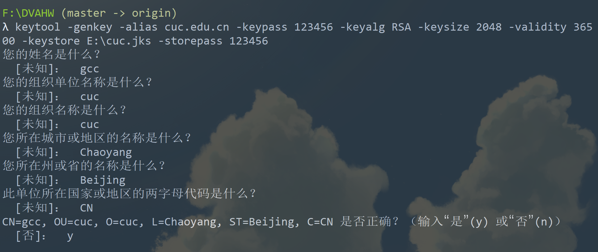

  查看生成的app-release.apk文件		

  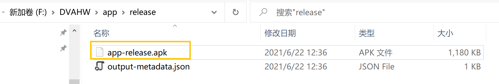

  ```cmd
  # 在app-release.apk文件所在目录执行如下命令
  # 确认 apktool 在系统 PATH 环境变量中可找到
  apktool d app-release.apk
  
  # 由于没有重启电脑更新环境变量，使用如下语句
  java -jar F:\apktools.jar d d app-release.apk
  ```

  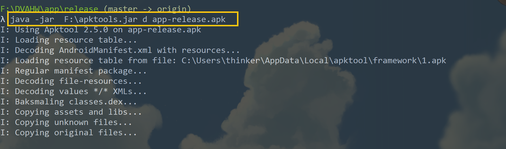

- 反汇编出来的`smali`代码位于apktool输出目录下的 **smali** 子目录，源代码目录中的 **res** 目录也位于输出目录的一级子目录下

  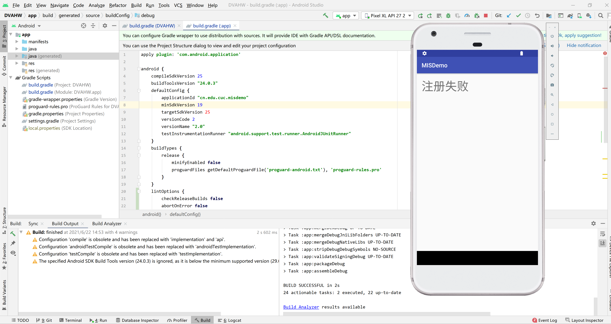

  如上图所示，是[Deliberately Vulnerable Android Hello World](https://github.com/c4pr1c3/DVAHW)在模拟器中运行，输入注册码错误时的提示信息页面。注意到其中的提示消息内容为：**注册失败**


- 依据此**关键特征**，在反汇编输出目录下进行**关键字查找**

  ```bash
  grep '注册失败' -R .
  
  grep '注册成功' -R .
  
  grep 'register_ok' -R .
  
  # 根据register_ok的资源唯一标识符查找
  grep '0x7f0b0025' -R .
  ```

  ​	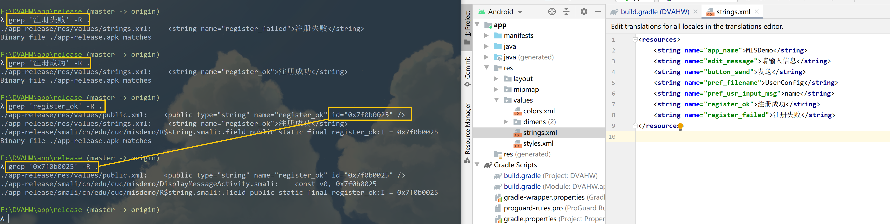

- 使用[atom](https://atom.io/)打开上述`DisplayMessageActivity.smali`，定位到包含该资源唯一标识符所在的代码行。同时，在Android Studio中打开`DisplayMessageActivity.java`源代码，定位到包含`textView.setText(getString(R.string.register_ok));`的代码行👇

  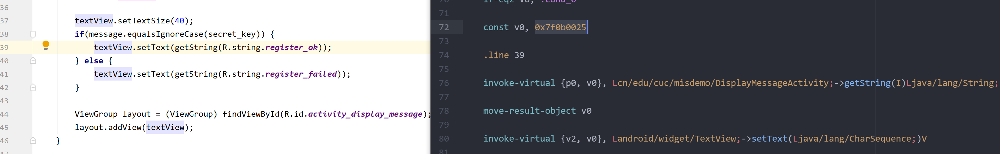

  上述smali代码注释说明如下：

  ```smali
  # 当前smali代码对应源代码的行号
  .line 39
  
  # 将 0x7f0b0025 赋值给寄存器v0
  const v0, 0x7f0b0025
  
  # invoke-virtual 是调用实例的虚方法（该方法不能是 private、static 或 final，也不能是构造函数）
  # 在非static方法中，p0代指this
  # 此处的实例对象是 cn.edu.cuc.misdemo.DisplayMessageActivity
  # Lcn/edu/cuc/misdemo/DisplayMessageActivity; 表示DisplayMessageActivity这个对象实例 getString是具体方法名
  # I表示参数是int类型
  # Ljava/lang/String; 表示 Java内置的String类型对象
  # 整个这一行smali代码表示的就是 调用 cn.edu.cuc.misdemo.DisplayMessageActivity对象的getString方法，传入一个整型参数值，得到String类型返回结果
  invoke-virtual {p0, v0}, Lcn/edu/cuc/misdemo/DisplayMessageActivity;->getString(I)Ljava/lang/String;
  
  # 将最新的 invoke-kind 的对象结果移到指定的寄存器中。该指令必须紧跟在（对象）结果不会被忽略的 invoke-kind 或 filled-new-array 之后执行，否则无效。
  # 其中 kind 典型取值如virtual、super、direct、static、interface等，详见Android开源官网的 'Dalvik 字节码' 说明文档
  move-result-object v0
  
  # 此处的v2赋值发生在 .line 37，需要注意的是这里的v2是一个局部变量（用v表示），并不是参数寄存器（用p表示）。
  # 当前initView()方法通过 .locals 定义了4个本地寄存器，用于保存局部变量，如下2行代码所示：
  # .method private initView()V
  #    .locals 4
  # V 表示 setText 的返回结果是 void 类型
  invoke-virtual {v2, v0}, Landroid/widget/TextView;->setText(Ljava/lang/CharSequence;)V
  ```

  


- 搞懂了上述smali代码的含义之后，我们破解这个**简单注册小程序** 的思路可以归纳如下：

  - 改变原来的注册码相等条件判断语句，对布尔类型返回结果直接取反，达到：只要我们没有输入正确的验证码，就能通过验证的“破解”效果；

    - 将 `if-eqz` 修改为 `if-nez`

      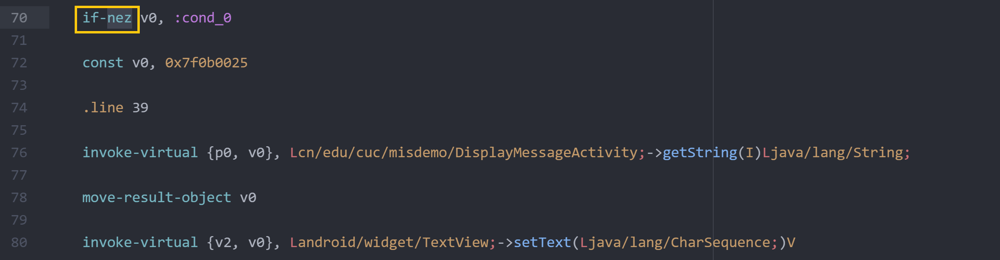

  - 在执行注册码相等条件判断语句之前，打印出用于和用户输入的注册码进行比较的“正确验证码”变量的值，借助`adb logcat`直接“偷窥”到正确的验证码；

    - 在 `invoke-virtual {v0, v1}, Ljava/lang/String;->equalsIgnoreCase(Ljava/lang/String;)Z` 代码之前增加2行打印语句

      ```smali
      //在.line36前添加
      const-string v2, "user input"
          
      .line 32
      invoke-static {v2, v0}, Landroid/util/Log;->d(Ljava/lang/String;Ljava/lang/String;)I
      
      const-string v2, "debug secret_key"
          
      .line 33
      invoke-static {v2, v1}, Landroid/util/Log;->d(Ljava/lang/String;Ljava/lang/String;)I
      ```

    - 对应于`DisplayMessageActivity.java`文件中添加以下语句

      ```java
      Log.d("user input", message);
      Log.d("debug secret_key", secret_key);
      ```

      

  - 上述2种思路都需要直接修改smali代码，然后对反汇编目录进行**重打包**和**重签名**。

### 重打包

```cmd
apktool b app-release
java -jar F:\apktools.jar b app-release
```

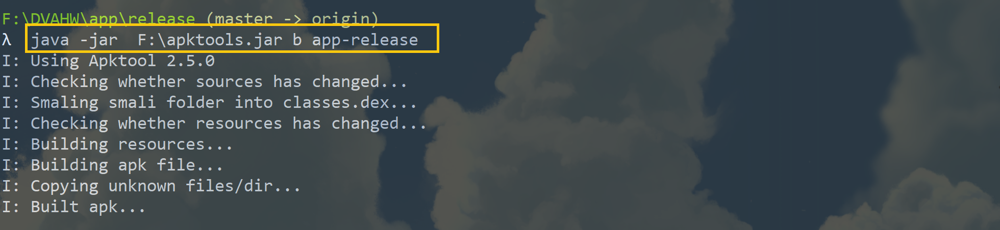


### 重签名


```cmd
cd app-release/dist/

<Android SDK Path>/build-tools/<valid version code>/apksigner sign --min-sdk-version 19 --ks <path to release.keystore.jks> --out app-release-signed.apk app-release.apk
```

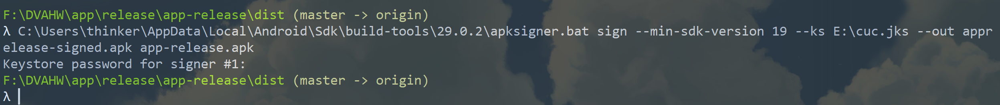

安装修改后的apk文件

```cmd
adb install F:\DVAHW\app\release\app-release\dist\app-release-signed.apk
```

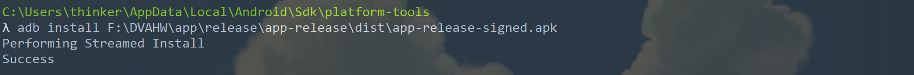

### 破解效果展示

直接通过“取反”注册码判断逻辑修改后的APK运行和使用效果如下：


通过**插桩**打印语句方式实现的直接“偷窥”正确注册码方法修改后的APK运行和使用效果如下：


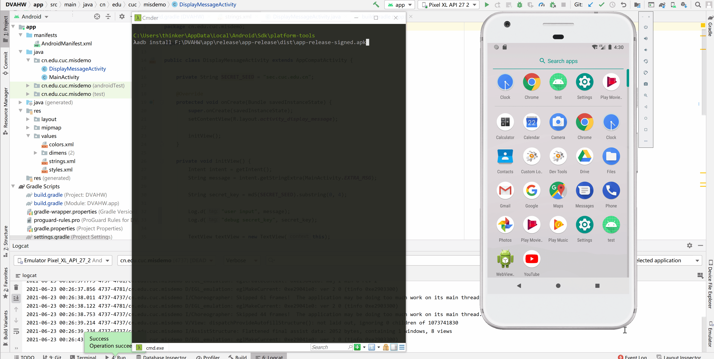


查看日志


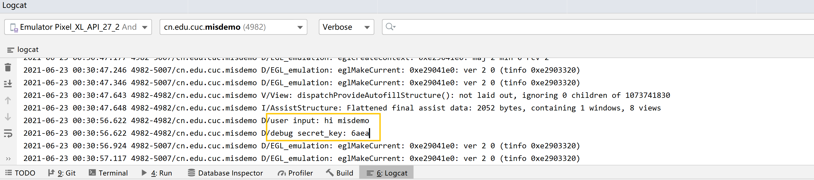

## 回答问题

**使用apktool反汇编上一章实验中我们开发的Hello World v2版程序，对比Java源代码和smali汇编代码之间的一一对应关系**

见上述实验过程->smali代码分析->smali代码注释说明部分

**对Hello World v2版程序生成的APK文件进行程序图标替换，并进行重打包，要求可以安装到一台未安装过Hello World v2版程序的Android模拟器中**

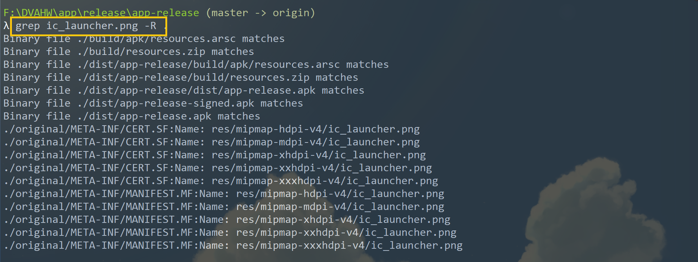

将要更改的图片命名为ic_launcher.png，在对应位置更改即可

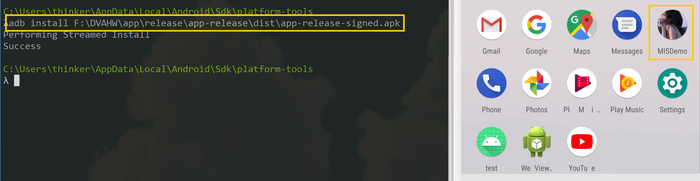

 **尝试安装重打包版Hello World v2到一台已经安装过原版Hello World v2程序的模拟器中，观察出错信息并解释原因**

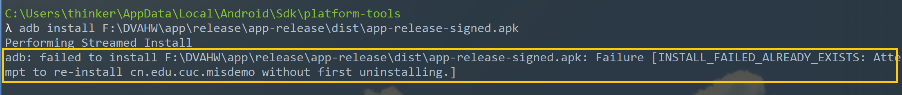

会报错【INSTALL_FAILED_ALREADY_EXISTS】，原因是Hello World v2程序曾经安装过，解决方法是将原来安装过的程序卸载即可

**去掉Hello World v2版程序中DisplayMessageActivity.java代码中的那2行日志打印语句后编译出一个新的apk文件，假设文件名是：misdemo-v3.apk，尝试使用课件中介绍的几种软件逆向分析方法来破解我们的认证算法**

- 插桩法见上述实验步骤

- 栈跟踪法

  - 在`DisplayMessageActivity.smali`中添加

    ```smali
    new-instance v0, Ljava/lang/Exception;
    const-string v1, "print trace"
    invoke-direct {v0, v1}, Ljava/lang/Exception;-><init>(Ljava/lang/String;)V
    invoke-virtual {v0}, Ljava/lang/Exception;->printStackTrace()V
    ```

  - 对应于`DisplayMessageActivity.java`文件中添加以下语句

    ```java
    new Exception("print trace").printStackTrace();
    ```

    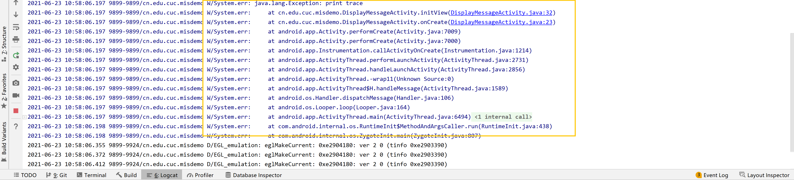

  - 记录了程序从启动到 `printStackTrace()` 被执行期间所有被调用过的方法，从下往上查看栈跟踪信息，很容易就可以找到在打印栈跟踪信息之前的完整函数调用过程

## **问题与解决方法**

- **在进行Hello World v1实验时，添加文本框时选择了TextView**

  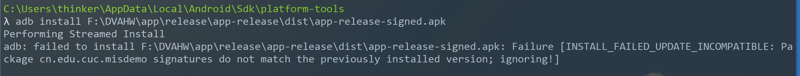

  解决方法：

  - 卸载之前安装过的包即可

  ```cmd
  adb shell pm uninstall cn.edu.cuc.misdemo
  ```

- build过程中lint报错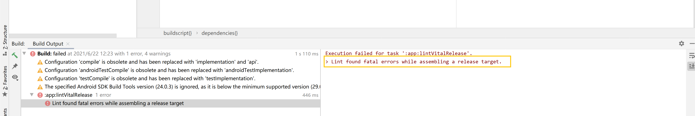

  解决方法：

  - ```java
    # 在build.gradle(Module: DVAHW.app)文件的android {}里添加
    lintOptions {
        checkReleaseBuilds false
        abortOnError false
    }
    ```

- 在生成apk文件时，无法创建.jks文件

  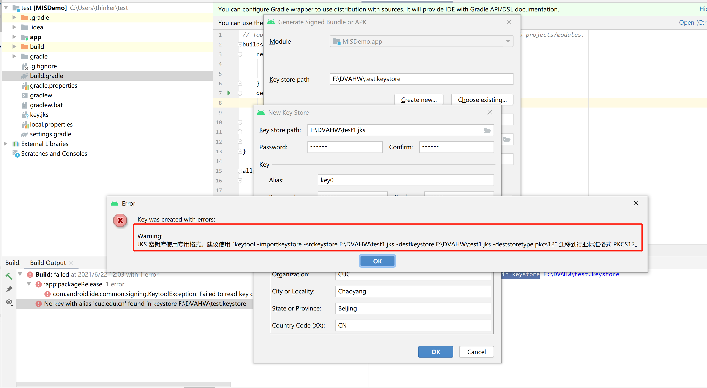

  解决方法：

  - 尝试了提示的命令，执行后还是报错

    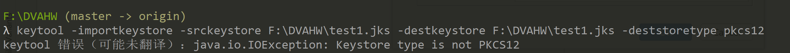

  - 最后使用命令行创建.jks文件成功，即【实验过程】中所呈现的

## **参考资料**

[实验七 软件逆向系列实验](https://c4pr1c3.github.io/cuc-mis/chap0x07/exp.html)

[Apktool install](https://ibotpeaches.github.io/Apktool/install/)

[Package signatures do not match the previously installed version](https://stackoverflow.com/questions/41709102/package-signatures-do-not-match-the-previously-installed-version)

[apktool反汇编常见异常问题](https://blog.csdn.net/t8116189520/article/details/80223351)

[developer.android](https://developer.android.com/studio/publish/app-signing.html?hl=zh-cn)

[android签名jks转pkcs12](https://blog.csdn.net/xiaoerye/article/details/114284426)


