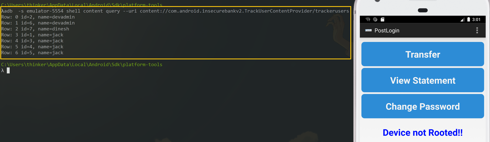
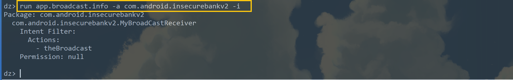
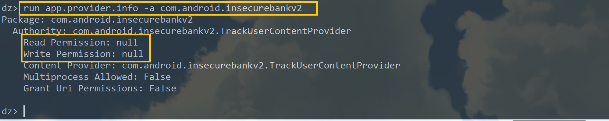

# 实验八 Android 缺陷应用漏洞攻击实验

## **实验目的**

- 理解 Android 经典的组件安全和数据安全相关代码缺陷原理和漏洞利用方法；
- 掌握 Android 模拟器运行环境搭建和 `ADB` 使用；

## **实验要求**

- [x] 详细记录实验环境搭建过程；

- [x] 至少完成以下 [实验](https://github.com/c4pr1c3/Android-InsecureBankv2/tree/master/Walkthroughs) ：

  - [x] Developer Backdoor
  - [x] Insecure Logging
  - [x] Android Application patching + Weak Auth
  - [x] Exploiting Android Broadcast Receivers
  - [x] Exploiting Android Content Provider

- [x] （可选）使用不同于 [Walkthroughs](https://github.com/c4pr1c3/Android-InsecureBankv2/tree/master/Walkthroughs)中提供的工具或方法达到相同的漏洞利用攻击效果；

  - [x] 推荐 [drozer](https://github.com/mwrlabs/drozer)


## **实验环境**

- [Android-InsecureBankv2](https://github.com/c4pr1c3/Android-InsecureBankv2)
- Android Studio 4.1.2
- AVD
  - Pixel XL API 27 2
  - Pixel 4 API 30
- MobSF v3.4
- python 2.7.16
- drozer v2.4.4
- pipenv version 2021.5.29

## **实验过程**

### 实验环境搭建过程

- 安装pipenv

  ```cmd
  # windows下安装pipenv
  pip install --user pipenv

  # 将pipenv添加进环境变量中

  # 查看pipenv版本
  pipenv --version
  ```

  

- 创建pipenv虚拟环境并运行http服务器

  ```cmd
  # 切换目录
  cd Android-InsecureBankv2\AndroLabServer\
  
  # 启动python2的虚拟环境
  pipenv install -r requirements.txt --two
  
  # 进入 pipenv 环境
  pipenv shell
  
  # 运行http服务器
  python app.py
  ```

  

- 连接模拟器并安装apk

  ```adb
  # 连接
  adb connect 192.168.56.1:8888
  
  # 查看当前设备
  adb devices
  
  # 安装apk
  adb install InsecureBankv2.apk
  ```

  

  

- apk安装成功，并修改端口

  

  

- 使用` dinesh/Dinesh@123$ or jack/Jack@123$`登陆

  

### 反编译处理过程

- MobSF开源框架介绍

  对InsecureBankv2.apk的反编译，此处使用了[MobSF](https://github.com/MobSF/Mobile-Security-Framework-MobSF)开源框架进行处理，此处给出官方功能说明👇

  > Mobile Security Framework (MobSF) is an automated, all-in-one mobile application (Android/iOS/Windows) pen-testing, malware analysis and security assessment framework capable of performing static and dynamic analysis.

- 安装MobSF环境

  ```cmd
  # 由于MobSF运行在python3的环境下，于是在pipenv中运行
  git clone https://github.com/MobSF/Mobile-Security-Framework-MobSF.git
  
  # 切换目录
  cd Mobile-Security-Framework-MobSF
  
  # 启动python3的虚拟环境
  pipenv install -r requirements.txt --three
  
  # 进入 pipenv 环境
  pipenv shell
  
  # 安装
  setup.bat
  
  # 运行
  run.bat 127.0.0.1:8000
  ```

  

- 在网页端访问`http://127.0.0.1:8000/`打开框架

  

- 上传并分析InsecureBankv2.apk

  

- 同时看到后台有具体的分析记录

  

### 实验

#### Developer Backdoor

- 在`LoginActivity.java`中查看`performLogin()`方法分析登录过程	


- 查看`DoLogin.java`活动，发现使用`devadmin`的用户名，无论是否输入密码或密码是否输入正确，都会登录成功

  


- 测试结果👇

  

#### Insecure Logging

- 在`DoLogin.java`文件中，发现每当用户尝试登录时，都会产生一条调试日志消息

  

##### 

- 在`ChangePassword.java`文件中，发现每当更改密码时，会将新密码打印出来

  

- 使用`adb logcat`查看日志记录

  ```adb
  # 查看模拟器中的日志记录
  adb logcat | grep "Successful Login"
  adb logcat | grep "Password"
  ```

  

- 测试结果👇

  


#### Android Application patching + Weak Auth

- 使用vscode在反编译出的文件下找到`string.xml`，查看到`is_admin`字样

  

- 将`apktool.yml`重新打包签名生成的apk装在模拟器上即可

  

- 点击按钮发现不能正常使用，有无按钮的前后对比👇

  

#### Exploiting Android Broadcast Receivers

- 在`AndroidManifest.xml`中找到`Broadcast receiver`的声明

  

- 在`ChangePassword.java`和`MyBroadCastReceiver.java`中找到了传递给`Broadcast Receiver`的参数

  

  ​	

- 下述命令会自动连接`Broadcast receiver`并发送带有密码的短信

  ```adb
  adb shell am broadcast -a theBroadcast -n com.android.insecurebankv2/com.android.insecurebankv2.MyBroadCastReceiver --es phonenumber 5554 --es newpass Dinesh@123!
  ```

  

- 查看请求和回复的短信

  

- 测试发现，依然无法使用修改后的密码`Dinesh@123!`进行登陆，只能使用原密码登陆

#### Exploiting Android Content Provider

- 在`AndroidManifest.xml`中找到`Content Provider`的声明

  

- 在`TrackUserContentProvider.java`中找到了传递给`Content Provider`的参数

  

- 查看所有用户的登录历史记录

  ```adb
  adb shell content query --uri content://com.android.insecurebankv2.TrackUserContentProvider/trackerusers
  ```

  


### drozer实验

#### 实验环境搭建过程

- 安装[drozer](https://github.com/FSecureLABS/drozer/releases)环境

  

- 下载[agent](https://github.com/mwrlabs/drozer/releases/download/2.3.4/drozer-agent-2.3.4.apk)并安装

  ```adb
  adb install drozer-agent-2.3.4.apk
  ```

- 转发端口并建立连接

  ```adb
  adb forward tcp:31415 tcp:31415
  
  drozer console connect
  ```

  

#### 实验

##### 使用drozer实现Exploiting Android Activities

- 列出所有导出的activity，且启动下列activity的权限都为`NULL`，即可实现绕过登录，并启动任何一个activity

  

- 测试结果👇

  

##### 使用drozer实现Intent Sniffing and Injection


- 应用程序在更改用户密码时使用**隐式Intent**，drozer可以利用意图嗅探，在用户修改密码后收到意图并查看敏感密码

  ```drozer
  run app.broadcast.sniff --action "theBroadcast"
  ```

- 测试结果👇

  

##### 使用drozer实现Exploiting Android Broadcast Receivers

- 获取有关`Broadcast Receiver`的信息

  

- 触发`Broadcast receiver`并发送带有密码的短信

  ```drozer
  run app.broadcast.send --action theBroadcast --extra string phonenumber 5554 --extra string newpass Dinesh@123!
  ```

  

##### 使用drozer实现Exploiting Android Content Provider

- 获取有关`Content Provider`的信息，`Read Permission`和`Write Permission`为空表示可以通过`Content Provider`查询数据

  

- 发现了可访问的`content url`

  

- 通过上述`content url`进行查询，结果显示了所有用户的登录历史记录

  

## **问题与解决方法**

- `adb connect`无法连接，目标计算机积极拒绝

  

  但检查可以正常ping通

  

  解决方法：

  - 重启😅（虽然很粗鲁，但是确实好用）

  
  
- 执行wget过程中，openssl报错`OpenSSL: error:1407742E:SSL routines:SSL23_GET_SERVER_HELLO:tlsv1 alert protocol version`

  

  解决办法：

  - 下载了新版本的wget

- 下载`drozer-2.4.4.win32.msi`电脑显示发现病毒，并且多次帮我删除😅

  

  解决方法：

  - 使用wget命令下载，并且无视windows defender的警告😅

- java报错`java 不是内部或外部命令，也不是可运行程序`

  解决方法：

  - 根据[大佬的博客](https://www.cnblogs.com/lsdb/p/9441813.html)重新安装了java环境

- 在drozer开启后，list为空

  

  解决方法：

  - 退出drozer，切换到python27的目录下，再重新建立连接即可

## **参考资料**

[第八章 Android 缺陷应用漏洞攻击实验](https://c4pr1c3.github.io/cuc-mis/chap0x08/homework.html)

[移动互联网安全（2021）](https://www.bilibili.com/video/BV1rr4y1A7nz?p=162)

[pipenv install](https://www.pythontutorial.net/python-basics/install-pipenv-windows/)

[MobSF Documentation](https://mobsf.github.io/docs/#/zh-cn/)

[How to setup and use Mobile Security Framework(MobSF)](https://desk.zoho.com/portal/vegabirdtech/en/kb/articles/how-to-setup-and-use-mobile-security-framework-mobsf)

[Android InsecureBankv2 Walkthrough: Part 1](https://infosecwriteups.com/android-insecurebankv2-walkthrough-part-1-9e0788ba5552)

[Android InsecureBankv2 Walkthrough: Part 2](https://infosecwriteups.com/android-insecurebankv2-walkthrough-part-2-429b4ab4a60f)

[python3环境下pipenv的使用介绍](https://blog.csdn.net/wuge507639721/article/details/84075063)

[在启动MobSF时，一直报JDK 8+ is not available的问题](https://github.com/MobSF/Mobile-Security-Framework-MobSF/issues/1024)

[Java基础1-环境篇：JDK安装与环境变量配置](https://blog.csdn.net/godot06/article/details/104378253)

[wget OpenSSL: error:1407742E:SSL routines:SSL23_GET_SERVER_HELLO:tlsv1 alert protocol version](https://blog.csdn.net/john1337/article/details/91038129)

[drozer install](https://github.com/FSecureLABS/drozer)

[drozer安装使用教程（Windows）](https://www.cnblogs.com/lsdb/p/9441813.html)


